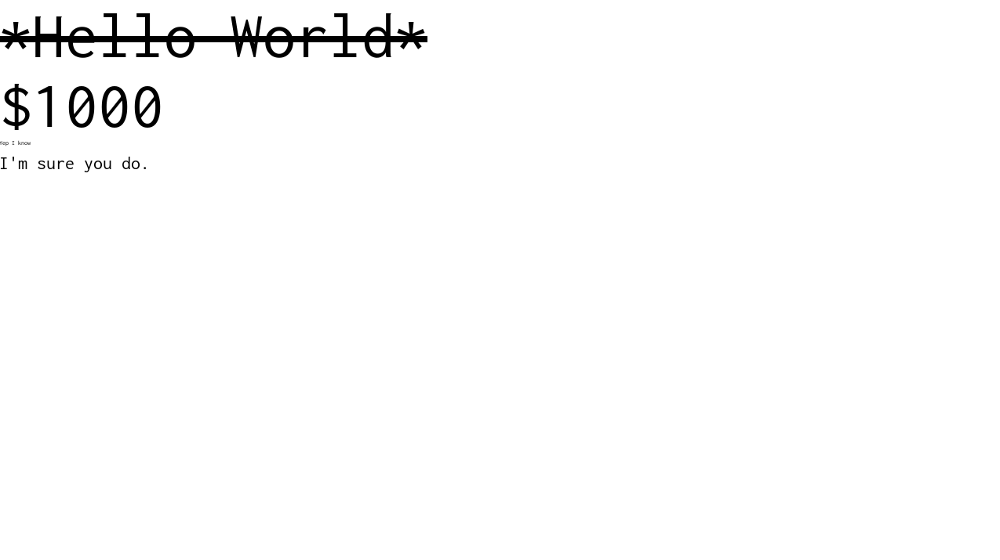
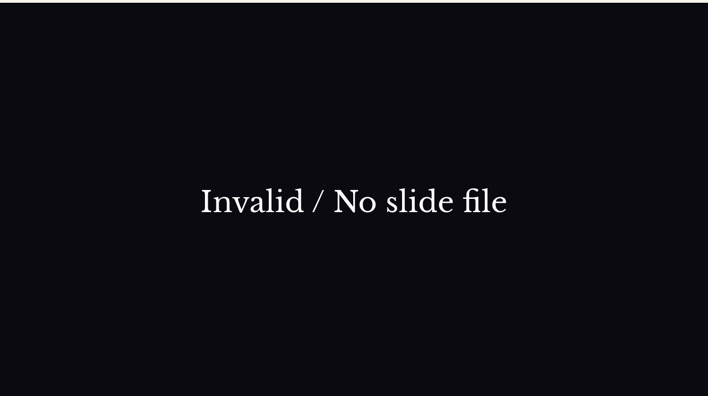
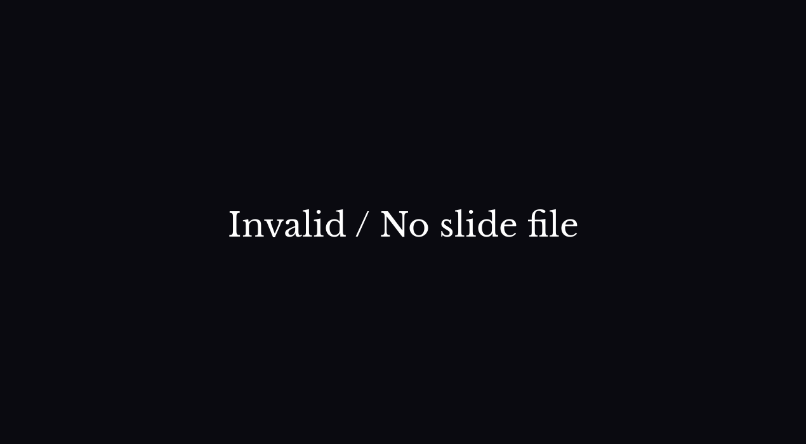

# slideshow
This is a small slideshow program that I made to practice writing Rust.
As a C/C++ programmer, wrapping my head around lifetimes can really hurt.

## Feature List Summary
It is useful for producing small slideshows relatively quickly without much knowledge.

- Multiple Pages
- Basic Styling (Fonts, Small Markup, Color, Arbitrary Positioning)
   - **Bolding**, _Italics_, __Underline__, ~~Strikethrough~~
- Resolution and aspect ratio independence
   - Will provide blackbars on resolutions with different aspect ratios
- Image drawing
- Dynamically changing and accurate font cache with Unicode support
   - Dynamically sizes for different resolutions to ensure crisp text
   - *Caches text lines* instead of *glyphs*, which allows for accurate rendering of text
- Slide transitions (3 types)
   - Horizontal slideout/in
   - Vertical slideout/in
   - Fade to color

## Technical Description

This slideshow program is made with Rust, and is feature complete. It
is sufficient enough for me to quickly produce slides whenever I need
to make presentations.

It's not very difficult to use, and certainly less skill required than
using Powerpoint. Of course it is also more minimal than a
fully-fledged Office program, but this is very quick.

Slides are produced through a custom markup language (complete with a
custom parser for this language), which supports the styling options
presented above. This markup language supports specifying page
transitions of up to 3 types.

Since this is a visual presentation program, the way I render stuff
has to be pretty precise and instead of using a glyph-cache which is
extremely common I've opted to use a text-cache. This was chosen
because of how complex rendering text accurately is. I choose to cache
text-lines/words instead of individual glyphs, as for instance certain
combinations of graphemes will produce a different glyph. This is most
commonly seen in _ligatures_, but is also present in some languages
such as Arabic.

I recache the font if resolution changes, and cache all the text in a
slideshow when it is rendered this ensures it always looks *crisp and
clean* while the cache prevents the performance of rendering text from
slowing the program down.

SDL2 and it's family libraries are used for rendering things.

Since this is written in Rust, it should be pretty fault proof thanks to it's memory safety.

## Media



## Compile / Build
This thing depends on sdl2-rs and uses [Libre Baskerville](https://fonts.google.com/specimen/Libre+Baskerville)
as the default font.

Those files are included, and this should be buildable, and runnable with

```
cargo build
cargo run
```

Which I admit is way more convenient than my C projects.

## Usage / Running

Running the program will lead to a blank page It includes a dummy
slideshow that was used for testing which also demonstrates all the
features of the markup language.

The page in question will look like this:

